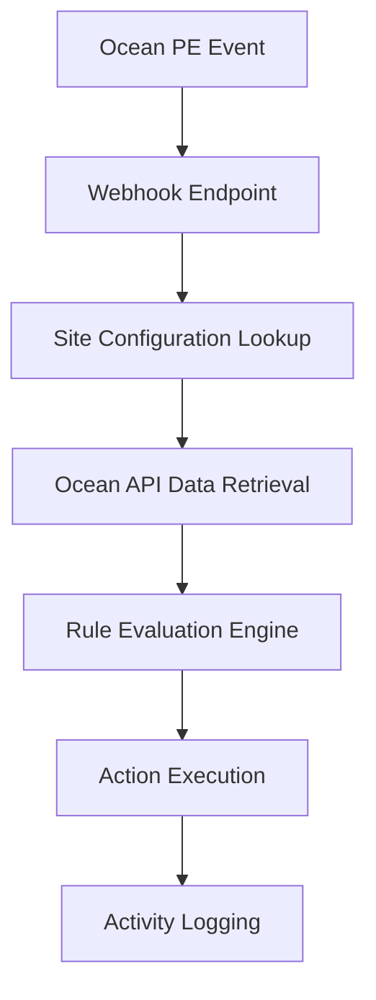

# Patient Engagement (PE) Rule Evaluation Setup and Development Guide

(caution; AI generated document so please forgive errors )
This document provides comprehensive instructions for setting up and developing patient engagement (PE) rule evaluation within the Ocean Autorouter system.

## Table of Contents

1. [Overview](#overview)
2. [System Architecture](#system-architecture)
3. [Setup Instructions](#setup-instructions)
4. [Testing](#testing)
5. [Development Workflow](#development-workflow)
6. [Rule Development](#rule-development)
7. [Troubleshooting](#troubleshooting)

## Overview

The Ocean Autorouter's Patient Engagement system allows automated rule evaluation triggered by Ocean patient engagement events such as form completions and note additions. The system uses AI-powered rule engines to process patient data and execute automated actions based on configured routing rules.

### Key Components

- **Webhook Endpoint**: Receives PE events from Ocean
- **Rule Evaluation Engine**: AI-powered processing of PE rules
- **Site Configuration**: Tenant-specific Ocean credentials
- **Activity Logging**: Comprehensive audit trail

## System Architecture

### Event Flow



### Key Files Structure

```
src/application/use-cases/
├── process-patient-engagement-event.use-case.ts    # Main PE processing logic

src/entities/models/
├── patient-engagement-event-context.ts             # PE event types and context
├── routing-rule.ts                                 # Rule definitions

src/infrastructure/services/
├── prompts/
│   ├── evaluate-pe-rule-prompt.ts                  # PE rule prompt generation
│   └── pe-event-summarizer.ts                      # PE event data summarization

server/api/openapi/webhook/
└── [clientId].ts                                   # Webhook handler

.vscode/
├── webhook-test-data.json                          # Test data for development
└── tasks.json                                      # VS Code debugging tasks
```

## Setup Instructions

### 1. Ocean Configuration

To set up a PE integration, you need to enter credentials in both Ocean and the Autorouter:

#### Ocean Setup

1. Navigate to Ocean Portal Admin → Manage Credentials
2. Generate or obtain your Site Key, Site Credential, and Shared Encryption Key
3. Configure webhook endpoint in Ocean

#### Autorouter Setup

1. Access the Portal → Site Configuration
2. Configure Ocean Open API credentials:
   - **Site Key**: Your Ocean site identifier (https://ocean.cognisantmd.com/ocean/portal.html#/admin/credentials/)
   - **Site Credential**: Authentication credential for the site (https://ocean.cognisantmd.com/ocean/portal.html#/admin/credentials/)
   - **Shared Encryption Key**: Used for encrypting/decrypting patient data
3. Save the configuration

### 2. Webhook Endpoint Configuration

The webhook endpoint should follow this pattern:
- AUTOROUTER_SITE_CLIENT_ID is the internal unique identifier for your Ocean site configuration in the Autorouter. Not the OAuth Client ID.
- site_config.clientId (in the DB)
https://(AUTOROUTER_HOST)/api/openapi/webhook/(AUTOROUTER_SITE_CLIENT_ID)
```

**Example:**

```
https://your-autorouter-host.com/api/openapi/webhook/6c8d1149-a07d-4a55-b721-ef3d561b3828
```

The webhook handler (`server/api/openapi/webhook/[clientId].ts`) automatically:

- Validates the client ID in the URL path
- Retrieves tenant-specific site configuration
- Fetches patient and note data from Ocean
- Processes PE rules

## Testing

### Local Development Testing

Use the VS Code task "Call OpenAPI Webhook" to test the integration:

1. Ensure your development server is running (`npm run dev`)
2. Execute the task via VS Code Command Palette (F1) → "Tasks: Run Task" → "Call OpenAPI Webhook"
3. This POSTs the `webhook-test-data.json` content to the endpoint

### Test Data Format

The test data follows Ocean's webhook format:

```json
{
  "ref": "690",
  "siteNum": "1234",
  "type": "notify-patient-note-added",
  "changeList": null,
  "user": null,
  "customProperties": {
    "noteCompletionSource": "PORTAL",
    "oceanSessionId": "1759442545187t415674"
  }
}
```

### Webhook Event Types

Supported Ocean PE events mapped to internal types:

- `notify-patient-message-forms-completion` → `patient_message_forms_completion`
- `notify-patient-note-added` → `patient_note_added`

### Manual Testing with curl

```bash
curl -X POST \
  -H "Content-Type: application/json" \
  -d @.vscode/webhook-test-data.json \
  "localhost:4000/api/openapi/webhook/YOUR_CLIENT_ID"
```

## Development Workflow

### 1. Understanding the Processing Flow

When a PE event is received:

1. **Webhook Handler** (`[clientId].ts`):

   - Validates client ID from URL
   - Retrieves site configuration by client ID
   - Fetches patient data using Ocean Open API
   - Retrieves patient note via oceanSessionId
   - Creates PatientEngagementEventContext

2. **Use Case Execution** (`process-patient-engagement-event.use-case.ts`):

   - Retrieves all active routing rules for the tenant
   - Evaluates each rule against the PE event
   - Executes triggered rule actions
   - Logs activity and results

3. **Rule Evaluation** (`evaluate-pe-rule-prompt.ts`):
   - Creates AI prompt with PE event context
   - Summarizes patient data and form responses
   - Applies user-defined rule logic
   - Returns AI-suggested actions

### 2. Data Context Available to Rules

Rules have access to comprehensive patient data through the PE event:

#### Patient Information (from OceanPatient)

- Ocean Patient Reference
- EMR Patient ID / MRN
- Demographics (age, language, gender, address)
- Family/Clinic doctor assignments
- Reason for visit/appointment
- Visit type
- CPP (Care Plan) data
- Lab results

#### Form Data (from PatientNote.ptUpdate.completedForms)

- JSON object containing all form field responses
- Field-level access to patient answers
- Form completion metadata

#### Progress Note (from PatientNote.ptUpdate.progressNote)

- Note title and text content
- Structured note data

## Rule Development

### 1. Configuring PE Routing Rules

Access: Portal → Routing Rules

#### Rule Configuration Fields

- **Name**: Descriptive rule name
- **Triggering Event**: Select `patient_note_added` or `patient_message_forms_completion`
- **Prompt**: Natural language instructions for the AI engine
- **Active**: Enable/disable rule
- **Enabled Tools**: Select available routing tools (email, SMS, etc.)

#### Example PE Rule Prompts

**Form-Based Action:**

```
If the patient completed a diabetes screening form and their blood sugar level is above 126 mg/dL, send an urgent email to their family doctor with the results and recommend immediate follow-up.
```

**Note-Based Action:**

```
When a progress note contains keywords related to mental health concerns, automatically schedule a follow-up appointment reminder via SMS.
```

### 2. Advanced Rule Filtering

To implement more sophisticated rule filtering based on PE criteria, you can extend the routing rule model:

#### Adding Constraint Fields to RoutingRule

Modify `src/entities/models/routing-rule.ts`:

```typescript
const schema = baseResourceSchema.merge(tenantConfinedSchema).extend({
  name: z.string(),
  triggeringEvent: routingEventTypeSchema,
  prompt: z.string(),
  active: z.boolean().default(true),
  enabledTools: z.array(z.string() as z.ZodType<RoutingToolName>).default([]),
  // New constraint fields
  constraintFields: z
    .array(
      z.object({
        path: z.string(), // JSON path expression (e.g., "customProperties.questionnaireResponse.item[2].answer[0].valueString")
        searchValue: z.string(), // Value to match against
        operator: z.enum(["equals", "contains", "greater", "less"]), // Comparison operator
      })
    )
    .optional(),
});
```

#### Implementing Constraint Logic

In `process-patient-engagement-event.use-case.ts`, add filtering logic:

```typescript
for (const rule of rules) {
  // Check constraints before evaluation
  if (rule.constraintFields) {
    const allConstraintsMet = rule.constraintFields.every((constraint) => {
      const value = evalValueFromPath(event.message, constraint.path);
      return evaluateConstraint(
        value,
        constraint.searchValue,
        constraint.operator
      );
    });

    if (!allConstraintsMet) {
      continue; // Skip this rule
    }
  }

  evaluationResults.push(
    await evaluateRuleService.evaluateRule({
      rule,
      routingEventMessage: event.message,
      eventType: event.triggeringEvent,
      requestDescription,
    })
  );
}
```

#### Example Constraint Usage

Access form fields using JSON paths:

- `note.ptUpdate.completedForms.diabetes_screening_blood_sugar`
- `note.ptUpdate.completedForms.depression_screening_score`
- `note.ptUpdate.completedForms.medication_adherence`

### 3. PE Event Summarization Enhancement

The current PE event summarization (`pe-event-summarizer.ts`) provides comprehensive patient context. To customize what data is available to rules:

1. **Modify Patient Data Exposure**:

   ```typescript
   // Add or remove patient fields in summarizePEEvent()
   if (patient.currentMedications) {
     summary += `Current Medications: ${JSON.stringify(
       patient.currentMedications
     )}\n`;
   }
   ```

2. **Enhance Form Data Structure**:
   ```typescript
   // Format completedForms for better AI consumption
   if (ptUpdate.completedForms) {
     summary += `## Completed Form Responses:\n`;
     Object.entries(ptUpdate.completedForms).forEach(([key, value]) => {
       summary += `- ${key}: ${value}\n`;
     });
   }
   ```

### 4. AI Prompt Optimization

Customize the PE rule evaluation prompt in `evaluate-pe-rule-prompt.ts`:

```typescript
export const createEvaluatePEEventRulePrompt = ({
  rule,
  peEventMessage,
  eventType,
}): string => {
  let prompt = `You are an intelligent automated routing engine for Ocean Patient Engagement events.

When triggered by these patient engagement events, you can use the following tools to follow the user instructions.
Only call a tool if you are confident that the user's instructions require it. It is perfectly fine to donothing.

IMPORTANT: You have access to detailed patient demographic information and form responses. Use this data intelligently to make clinically appropriate decisions.`;

  // ... existing prompt construction ...

  return prompt;
};
```

## Troubleshooting

### Common Issues

#### 1. Webhook Not Receiving Events

- **Check client ID**: Ensure URL includes correct client ID
- **Verify credentials**: Confirm Ocean Open API credentials are valid
- **Network connectivity**: Test webhook endpoint accessibility

#### 2. Rules Not Triggering

- **Event type mismatch**: Verify triggering event type matches Ocean event
- **Active status**: Ensure rules are marked as active
- **Tool permissions**: Confirm required tools are enabled for the rule

#### 3. Data Retrieval Failures

- **Ocean API credentials**: Validate site key, credential, and encryption key
- **Session ID**: Ensure oceanSessionId is present in webhook payload
- **Patient reference**: Verify patient ref exists in Ocean

#### 4. AI Evaluation Errors

- **Prompt clarity**: Simplify rule prompts for better AI comprehension
- **Tool availability**: Verify AI model has access to required routing tools
- **Context parameters**: Check that patient data is properly summarized

### Debug Tools

#### VS Code Tasks

- **Call OpenAPI Webhook**: Test webhook integration
- **Terminate Debugging Tasks**: Clean up development processes
- **ngrok**: Expose local webhook for external testing

#### Logging and Monitoring

- Review activity logs in Portal → Activity
- Check server logs for detailed error information
- Monitor webhook endpoint performance

#### Test Environments

- Use Ocean Test environment for development
- Implement comprehensive test cases with various event types
- Validate rule behavior across different patient scenarios

### Performance Considerations

- **Rule Processing**: Evaluate multiple active rules per event
- **Ocean API Calls**: Implement caching for frequently accessed data
- **AI Response Time**: Monitor and optimize prompt complexity
- **Concurrent Events**: Ensure system handles multiple simultaneous PE events

## Best Practices

1. **Security**: Never log patient PII in application logs
2. **Performance**: Implement proper error handling and timeouts
3. **Testing**: Validate rules with diverse patient scenarios
4. **Monitoring**: Track rule execution success rates
5. **Documentation**: Maintain clear rule prompts and constraints
6. **Scalability**: Consider rate limits for Ocean API integration

---

This guide provides the foundation for implementing and extending patient engagement rule evaluation. For additional support or advanced use cases, consult the development team or review the source code documentation.
